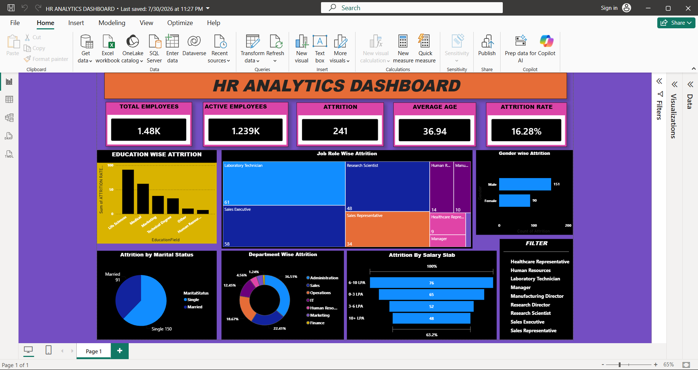

# HR Analytics Dashboard

## 📊 Project Overview
An interactive HR Analytics Dashboard developed using Microsoft Power BI to analyze employee data and identify key HR insights.

## 🛠️ Tools & Technologies
- Microsoft Power BI
- Power Query
- DAX
- Data Visualization
- Data Cleaning & Transformation

## 📈 Key Insights
- Total Employees
- Active Employees
- Employee Attrition
- Average Age
- Attrition Rate
- Education-wise Attrition
- Department-wise Attrition
- Job Role-wise Attrition
- Gender-wise Attrition
- Salary Slab Analysis
- Marital Status Analysis

## 🖼️ Dashboard Preview

